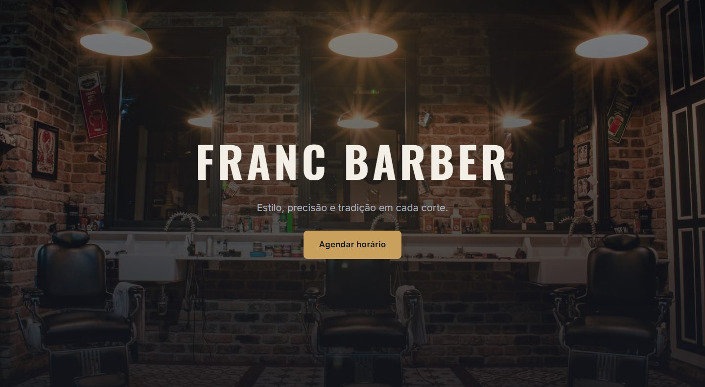
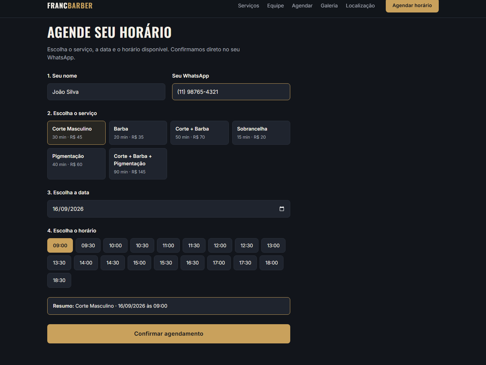
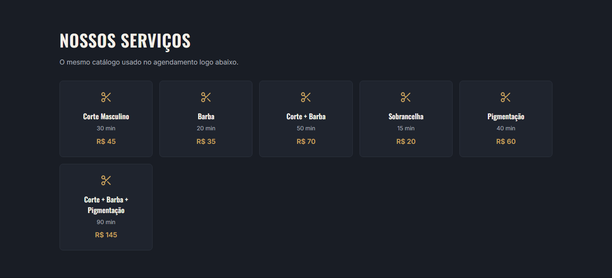

# Franc Barber

Landing page fictícia de barbearia com sistema de agendamento funcional, construída em **HTML, CSS e JavaScript puro** (sem frameworks, sem build tools). Projeto de portfólio focado em demonstrar lógica de agendamento e integração com WhatsApp — o tipo de sistema que negócios de serviço (barbearias, salões, clínicas) mais precisam.

**Demo:** https://riphunter002.github.io/Franc-Barber/



## Destaque técnico: lógica de agendamento

O coração do projeto é o sistema de agendamento em [agendamento.js](agendamento.js), construído manualmente (sem bibliotecas de calendário):

- Os horários disponíveis são calculados percorrendo o horário de funcionamento em uma grade fixa de 30 minutos e verificando, para cada candidato, se o intervalo `[início, início + duração do serviço)` colide com algum agendamento já existente naquele dia — por sobreposição real de intervalos, não apenas checagem de lista.
- Sem backend: uma lista de agendamentos fictícios simula horários já ocupados (incluindo casos de borda, como um serviço colado no horário de fechamento e uma manhã inteira com horários encostados um no outro).
- A duração de cada serviço decide automaticamente quais horários cabem antes do fechamento.
- Horários no passado são bloqueados no dia atual, e domingos aparecem como fechados.
- Ao confirmar, o sistema monta uma mensagem formatada (serviço, data, horário e nome do cliente) e abre o WhatsApp do cliente via link `wa.me`, já preenchida.



## Funcionalidades

- Header com menu hambúrguer responsivo
- Vitrine de serviços (nome, duração e preço) — mesma fonte de dados usada no agendamento
- Agendamento completo: dados do cliente → serviço → data → horário → confirmação via WhatsApp
- Seção Sobre/Equipe com os barbeiros
- Galeria de fotos
- Depoimentos de clientes
- Localização com mapa incorporado (OpenStreetMap) e botão para abrir no Google Maps
- Footer com redes sociais
- Animações discretas de fade-in ao rolar a página
- Totalmente responsivo, de 320px a 1920px



## Stack

- HTML5 semântico
- CSS3 (variáveis nativas, Grid e Flexbox)
- JavaScript vanilla (sem dependências de build)
- [Google Fonts](https://fonts.google.com/) (Oswald + Inter) e [Lucide Icons](https://lucide.dev/) via CDN

## Estrutura do projeto

```
├── index.html        # marcação de todas as seções
├── style.css         # estilos e responsividade
├── agendamento.js     # dados de serviços + lógica de disponibilidade/agendamento
└── script.js          # menu mobile, ícones e animação de fade-in
```

## Rodando localmente

Não depende de servidor nem de instalação de dependências — é só abrir o `index.html` no navegador (ou usar uma extensão como o Live Server, no VS Code, para recarregamento automático).

## Observações

Este é um projeto **fictício**, criado para fins de portfólio. Antes de usar como base para um cliente real, é preciso substituir:

- O número de WhatsApp em `agendamento.js` (`SHOP_WHATSAPP_NUMBER`)
- Os links de Instagram/Facebook e o número de WhatsApp no rodapé (`index.html`)
- Endereço, telefone e coordenadas do mapa na seção de localização
- As fotos (atualmente placeholders do Unsplash)
